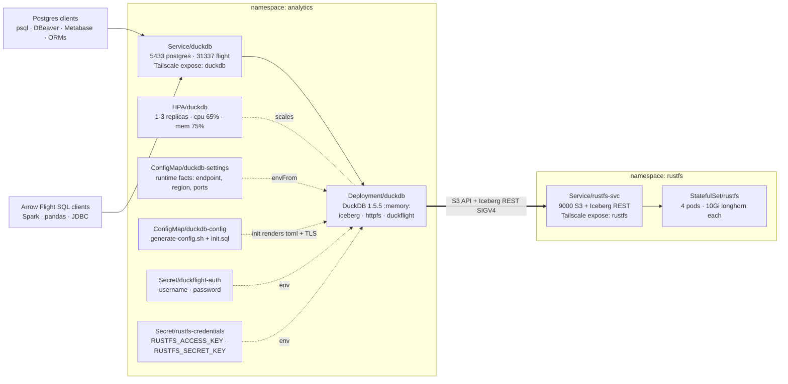
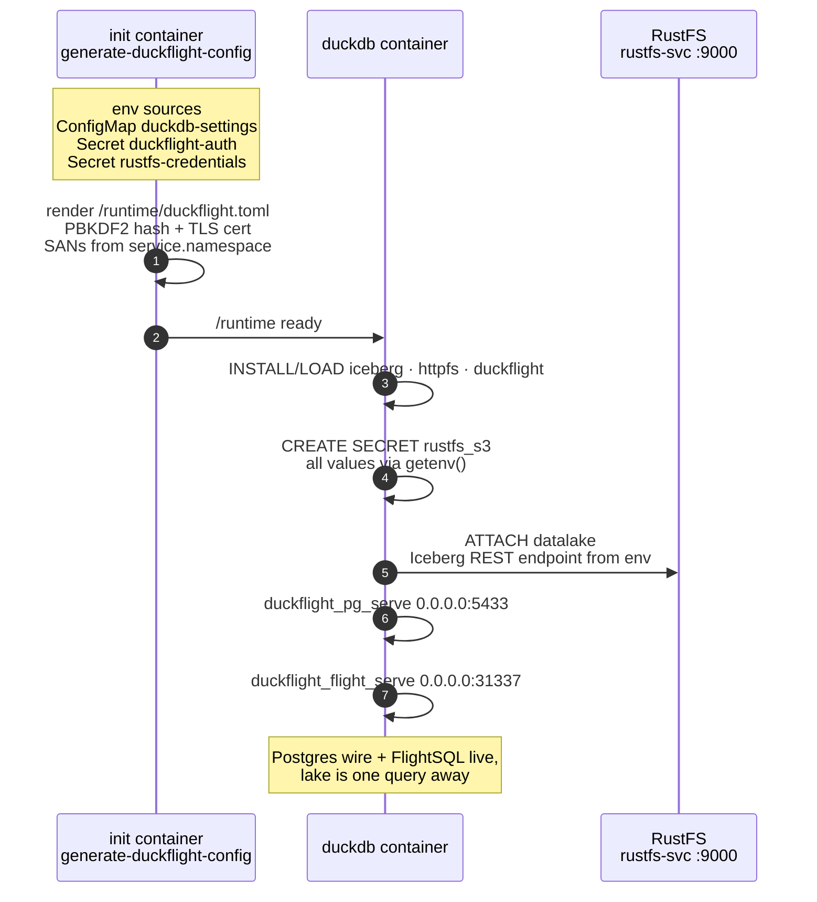
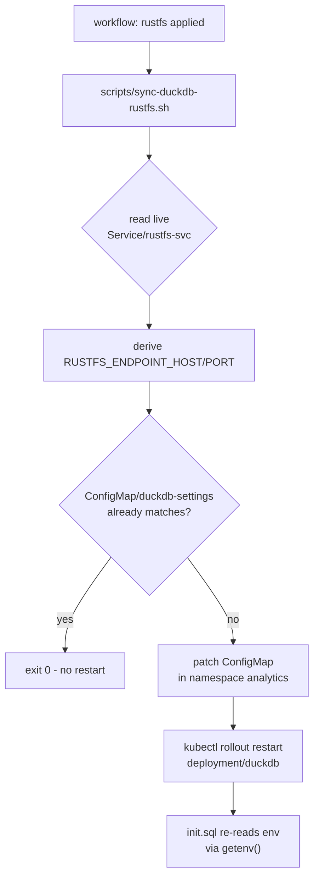

# Analytics — a Postgres endpoint for your data lake

Run a **modern data lake** on your own Kubernetes cluster, then query it like it's just... Postgres.

* **[RustFS](https://rustfs.com) v1.0.0** — the freshly released, S3-compatible object store written in Rust. Deployed distributed (4 pods × 1 drive, Longhorn PVCs) and hosting an **Apache Iceberg REST catalog** over your data.
* **DuckDB 1.5.5** — in-process analytical engine, `:memory:`, with the `iceberg` and `httpfs` extensions. It `ATTACH`es the RustFS catalog and reads Parquet data straight from object storage. No state to babysit.
* **DuckFlight** — a DuckDB community extension that exposes the **PostgreSQL wire protocol** (`:5433`) and **Arrow Flight SQL** (`:31337`), with TLS and PBKDF2-hashed credentials generated per boot.

The result: any Postgres client you already have — `psql`, DBeaver, Metabase, your app's ORM — connects and runs analytical SQL over the lake. No warehouse to size, no cluster to manage, no catalog to install separately.

## The pitch in one query

```bash
psql -h duckdb -p 5433 -U analyst
```

```sql
SELECT *
FROM duckflight_pg_serve('0.0.0.0:5433', '/runtime/duckflight.toml');
-- server up. now, from anywhere:

psql -h duckdb -p 5433 -U analyst -c "
  SELECT event, count(*)
  FROM   datalake.metrics.events
  WHERE  day >= today() - 7
  GROUP  BY event;"
```

That's a distributed Iceberg table on object storage, being scanned by DuckDB's vectorized engine, over a connection that your Postgres driver already speaks.

## Architecture

### Bird's-eye view



* DuckDB pods are **disposable** — the only state is in the lake. The HPA can scale `duckdb` 1→3 on CPU/memory pressure.
* Both services are exposed over **Tailscale** (`tailscale.com/expose`), so clients reach them from anywhere in the tailnet.

### What happens at pod start



### Keeping DuckDB aligned with RustFS



### Facts at a glance

| Aspect | Value |
|---|---|
| Namespaces | `analytics` (duckdb) · `rustfs` (object store) |
| DuckDB endpoints | `5433` Postgres wire · `31337` Arrow Flight SQL |
| RustFS endpoint | `rustfs-svc.rustfs.svc.cluster.local:9000` (S3 + Iceberg REST `/iceberg`) |
| Object storage | RustFS chart v1.0.0, distributed mode 4 pods × 1 drive, Longhorn 10Gi per pod |
| Scaling | HPA on duckdb: 1–3 replicas, CPU 65% / memory 75% |
| Exposure | Tailscale: `duckdb` and `rustfs` hostnames |
| Auth | DuckFlight PBKDF2-hashed creds + TLS, per-boot cert with `<service>.<ns>` SANs |
| Credentials | Single GitHub Secret pair, stamped by CI into both namespaces |

## Structure

```
analytics/                     # repo root for manifests (this dir)
├── namespace.yaml             # Namespace/analytics
├── kustomization.yaml         # root — order: namespace -> duckdb -> rustfs
├── duckdb/                    # DuckDB + DuckFlight (Postgres/FlightSQL endpoints)
│   ├── kustomization.yaml
│   ├── config-settings.yaml         # duckdb-settings ConfigMap (runtime facts)
│   ├── configmap.yaml               # duckdb-config (generate-config.sh + init.sql, getenv-driven)
│   ├── deployment.yaml              # duckdb/duckdb:1.5.5, :memory:, init renders config
│   ├── service.yaml                 # 5433 postgres, 31337 flight, tailscale expose
│   └── hpa.yaml                     # 1..3 replicas, cpu 65% / memory 75%
├── rustfs/                    # RustFS object store (chart v1.0.0, StatefulSet x4)
│   ├── kustomization.yaml           # Namespace/rustfs + helmCharts (repo charts.rustfs.com)
│   ├── namespace.yaml               # Namespace/rustfs
│   └── helm.yaml                    # chart values (distributed 4x1, longhorn, tailscale)
├── scripts/
│   └── sync-duckdb-rustfs.sh  # derive duckdb connection facts from deployed rustfs
└── .github/workflows/
    └── deploy.yaml            # module/action dispatcher (dispatch + call)
```

## Parameterization

Everything that can be parameterized is, via env / ConfigMap / Secret:

| Kind | Object | What it carries |
|---|---|---|
| ConfigMap | `analytics/duckdb-settings` | `DUCKDB_SERVICE_NAME`, `RUSTFS_PROTOCOL`, `RUSTFS_ENDPOINT_HOST/PORT`, `RUSTFS_REGION`, `DUCKFLIGHT_PG_PORT`, `DUCKFLIGHT_FLIGHT_PORT` |
| Secret | `analytics/duckflight-auth` | DuckFlight `username`/`password` (created by CI from GitHub Secrets) |
| Secret | `analytics` + `rustfs` `rustfs-credentials` | `RUSTFS_ACCESS_KEY`/`RUSTFS_SECRET_KEY` — same keys in both namespaces so chart and duckdb always match (created by CI from one GitHub Secret pair) |

Flow at pod start: the `generate-duckflight-config` init container renders `/runtime/duckflight.toml` (DuckFlight auth + TLS; SANs derived from `<service>.<namespace>`). The duckdb container runs `-init /etc/duckdb/init.sql`, which reads **all runtime facts from the container env via `getenv()`** — endpoint, region, protocol (which derives `USE_SSL`), ports, and S3 credentials. No SQL is rendered at startup; `init.sql` is the ConfigMap's plain SQL.

One deliberate literal: `ATTACH 'datalake' AS datalake` — DuckDB's grammar does not accept expressions for the catalog path/alias, so the catalog identifier is a SQL literal while everything else (endpoint, region, protocol, credentials) is env-driven.

## RustFS → DuckDB alignment

`scripts/sync-duckdb-rustfs.sh` is the alignment loop — rustfs is the source of truth:

1. Reads the **live** `Service/rustfs-svc` in ns `rustfs`
2. Derives `RUSTFS_ENDPOINT_HOST` (`<svc>.<ns>.svc.<cluster-domain>`) and `RUSTFS_ENDPOINT_PORT` (Service port named `endpoint`)
3. Patches ConfigMap `analytics/duckdb-settings` when the values differ
4. `kubectl rollout restart deployment/duckdb -n analytics` so `init.sql` re-reads

The script is idempotent — if the configmap already matches, it exits 0 with no restart. Run manually:

```bash
bash scripts/sync-duckdb-rustfs.sh
```

## Prerequisites

* `kubectl` + `kustomize` (kubectl 1.14+ embeds it) and **helm 3** (helmCharts inflation requires the helm binary)
* `longhorn` StorageClass
* `tailscale` operator with Service annotations `tailscale.com/expose`
* Namespaces are created by `namespace.yaml` (root) and `rustfs/namespace.yaml`; CI also ensures them idempotently

## Usage

> **Note:** `rustfs/` uses the helm chart inflator, so builds need `--enable-helm` and the helm binary. `kubectl apply -k` does not support `--enable-helm` — build first, then apply the rendered output (the CI workflow does exactly this):

```bash
kubectl kustomize --enable-helm . > built.yaml
kubectl apply -f built.yaml
kubectl diff -f built.yaml   # should be empty after apply
```

Note: `duckdb` references `rustfs-svc.rustfs.svc.cluster.local`, so applying the full stack leaves duckdb CrashLooping briefly until rustfs is ready and the sync script has run — it self-heals. Strict order if you want to avoid it:

```bash
kubectl kustomize --enable-helm rustfs/ | kubectl apply -f -
kubectl apply -k duckdb/
bash scripts/sync-duckdb-rustfs.sh
```

Per-component (duckdb alone needs no helm):

```bash
kubectl apply -k duckdb/
```

## CI/CD Workflow (`.github/workflows/deploy.yaml`)

Manual dispatch (also `workflow_call`). Inputs:

* `module`: `all` (root kustomization), `duckdb`, `rustfs`
* `action`: `apply` | `diff` | `delete` | `dry-run` | `restart`

Pipeline: validate module → checkout → kubectl v1.30 → helm v3.14 → Tailscale login (`tag:git`) → write kubeconfig from the `KUBECONFIG` secret → ensure namespaces → create secrets from GitHub Secrets → `kubectl kustomize --enable-helm` build → execute action (rendered manifests are applied with `apply -f`, since `kubectl apply -k` cannot inflate helm charts).

Behavior notes:

* `apply` always runs the sync script afterwards (idempotent — no restart when already aligned), so rustfs changes propagate to duckdb automatically
* `restart` maps: `duckdb` → `deployment/duckdb -n analytics`; `rustfs` → `statefulset/rustfs -n rustfs`; `all` → both
* `delete` deletes the module's rendered kustomization (`--ignore-not-found`)

Required GitHub Secrets:

| Secret | Purpose |
|---|---|
| `KUBECONFIG` | Kubeconfig reaching the cluster (Tailscale) |
| `TAILSCALE_CLIENT_ID`, `TAILSCALE_AUTH_KEY` | Tailscale OAuth for the runner |
| `RUSTFS_ACCESS_KEY`, `RUSTFS_SECRET_KEY` | Stamped into `rustfs-credentials` in **both** namespaces |
| `DUCKFLIGHT_USER`, `DUCKFLIGHT_PASSWORD` | Stamped into `duckflight-auth` |

## Secrets

* No Secret manifests are stored in the repo — CI creates/updates them from GitHub Secrets on every run (`kubectl create secret ... --dry-run=client -o yaml | kubectl apply -f -`)
* Rotate: update the GitHub Secret, run this workflow with `action=apply`, then `action=restart` with `module=duckdb` (rustfs picks up creds on its own restart)

## Maintenance Notes

* 1 file per resource — `git log -- <file>` isolates history
* Helm chart upgrades: bump `version:` in `rustfs/kustomization.yaml`; helm values live in `rustfs/helm.yaml` only
* Changing `drivesPerNode` on an existing RustFS StatefulSet is not allowed (chart rule) — topologies are fixed after first deploy
* The `duckdb-settings` ConfigMap is kustomize-managed with static defaults; the sync script's patch is the only external mutation and is re-derived on every `apply`
