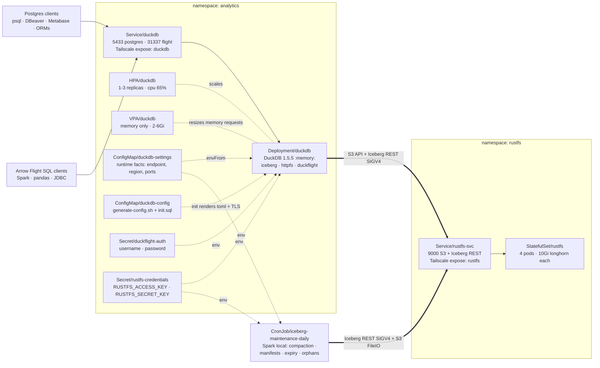
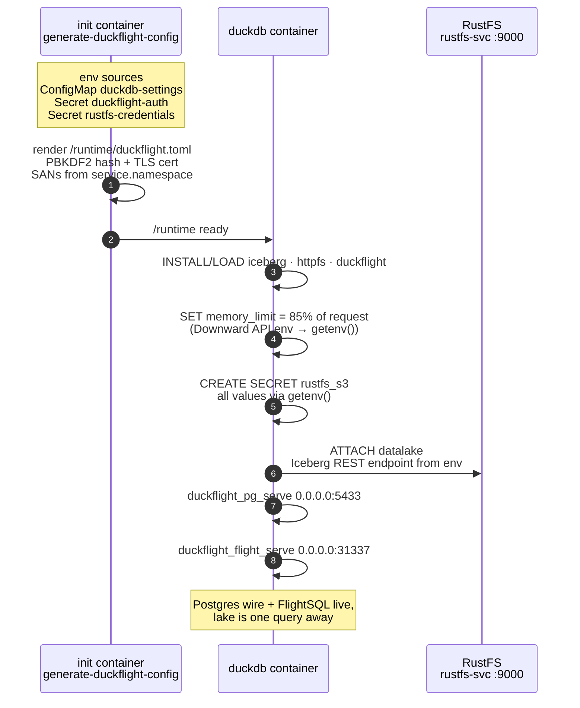
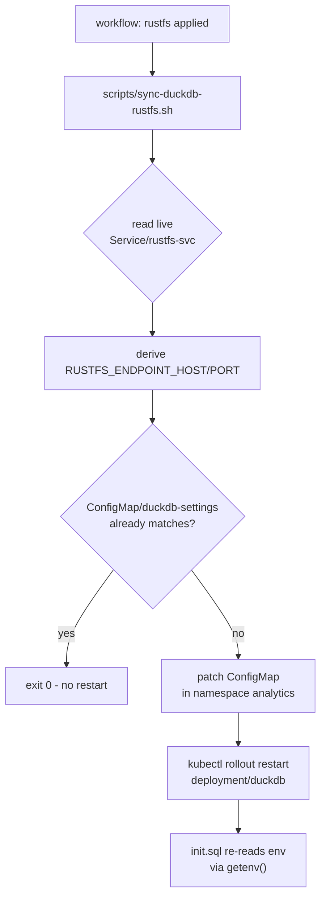

# Analytics — a Postgres endpoint for your data lake

Run a **modern data lake** on your own Kubernetes cluster, then query it like it's just... Postgres.

* **[RustFS](https://rustfs.com) v1.0.0** — the freshly released, S3-compatible object store written in Rust. Deployed distributed (4 pods × 1 drive, Longhorn PVCs) and hosting an **Apache Iceberg REST catalog** over your data.
* **DuckDB 1.5.5** — in-process analytical engine, `:memory:`, with the `iceberg` and `httpfs` extensions. It `ATTACH`es the RustFS catalog and reads Parquet data straight from object storage. No state to babysit.
* **DuckFlight** — a DuckDB community extension that exposes the **PostgreSQL wire protocol** (`:5433`) and **Arrow Flight SQL** (`:31337`), with TLS and PBKDF2-hashed credentials generated per boot.

The result: any Postgres client you already have — `psql`, DBeaver, Metabase, your app's ORM — connects and runs analytical SQL over the lake. No warehouse to size, no cluster to manage, no catalog to install separately.

## The pitch in one query

```bash
psql -h duckdb -p 5433 -U analyst
```

```sql
SELECT *
FROM duckflight_pg_serve('0.0.0.0:5433', '/runtime/duckflight.toml');
-- server up. now, from anywhere:

psql -h duckdb -p 5433 -U analyst -c "
  SELECT event, count(*)
  FROM   datalake.metrics.events
  WHERE  day >= today() - 7
  GROUP  BY event;"
```

That's a distributed Iceberg table on object storage, being scanned by DuckDB's vectorized engine, over a connection that your Postgres driver already speaks.

## Architecture

### Bird's-eye view



* DuckDB pods are **disposable** — the only state is in the lake. The HPA scales `duckdb` 1→3 on CPU pressure; the VPA owns memory sizing (2–6Gi, `InPlaceOrRecreate` — request raises resize the pod in place, no restart), and each pod re-derives its `memory_limit` from the request at start.
* Both services are exposed over **Tailscale** (`tailscale.com/expose`), so clients reach them from anywhere in the tailnet.

### What happens at pod start



### Keeping DuckDB aligned with RustFS



### Facts at a glance

| Aspect | Value |
|---|---|
| Namespaces | `analytics` (duckdb) · `rustfs` (object store) |
| DuckDB endpoints | `5433` Postgres wire · `31337` Arrow Flight SQL |
| RustFS endpoint | `rustfs-svc.rustfs.svc.cluster.local:9000` (S3 + Iceberg REST `/iceberg`) |
| Default bucket | `datalake` — created and enabled as an S3 table bucket by `Job/rustfs-bootstrap` on every rustfs/all apply |
| Object storage | RustFS chart v1.0.0, distributed mode 4 pods × 1 drive, Longhorn 10Gi per pod |
| Scaling | duckdb: HPA 1–3 replicas (CPU 65%) + VPA memory 2–6Gi (InPlaceOrRecreate) — `memory_limit` = 85% × request via the Downward API |
| Exposure | Tailscale: `duckdb` and `rustfs` hostnames |
| Auth | DuckFlight PBKDF2-hashed creds + TLS, per-boot cert with `<service>.<ns>` SANs |
| Credentials | Single GitHub Secret pair, stamped by CI into both namespaces |
| Iceberg maintenance | CronJob `iceberg-maintenance-daily` in `analytics` at 02:00 (compact → manifests → expire snapshots → orphan cleanup) · Spark local mode · image `ghcr.io/daun-gatal/analytics/iceberg-maintenance` (public, built by CI) |
| Data generator | `Deployment/generator-stream` (always-on: Wikimedia EventStreams SSE + Bluesky Jetstream WS → `datalake.events.*`, 60s/100-row buffered appends) + `CronJob/generator-batch` hourly at :15 (GH Archive + Wikimedia pageview dumps → `datalake.web.*`, overwrite-by-hour) · image `ghcr.io/daun-gatal/analytics/generator` (public, built by CI) |

## Structure

```
analytics/                     # repo root for manifests (this dir)
├── namespace.yaml             # Namespace/analytics
├── kustomization.yaml         # root — order: namespace -> duckdb -> rustfs -> maintenance
├── duckdb/                    # DuckDB + DuckFlight (Postgres/FlightSQL endpoints)
│   ├── kustomization.yaml
│   ├── config-settings.yaml         # duckdb-settings ConfigMap (runtime facts)
│   ├── configmap.yaml               # duckdb-config (generate-config.sh + init.sql, getenv-driven)
│   ├── deployment.yaml              # duckdb/duckdb:1.5.5, :memory:, init renders config
│   ├── service.yaml                 # 5433 postgres, 31337 flight, tailscale expose
│   ├── hpa.yaml                     # 1..3 replicas, cpu 65% (memory → VPA)
│   └── vpa.yaml                     # VPA: memory 2–6Gi, InPlaceOrRecreate — request feeds the Downward API env
├── rustfs/                    # RustFS object store (chart v1.0.0, StatefulSet x4)
│   ├── kustomization.yaml           # Namespace/rustfs + helmCharts (repo charts.rustfs.com)
│   ├── namespace.yaml               # Namespace/rustfs
│   ├── helm.yaml                    # chart values (distributed 4x1, longhorn, tailscale)
│   ├── bootstrap-config.yaml        # rustfs-bootstrap-config: bootstrap.sh + RUSTFS_ENDPOINT/BUCKET_NAME
│   └── bootstrap-job.yaml           # Job/rustfs-bootstrap — default bucket + S3 Tables enable, per apply
├── maintenance/               # Iceberg table maintenance (Spark local-mode CronJobs)
│   ├── kustomization.yaml           # pins the CI-built ghcr.io image
│   ├── configmap.yaml               # maintenance-config: maintenance.py + MAINT_* tunables
│   ├── cronjob.yaml                 # daily: compact / manifests / expire snapshots
│   └── image/
│       └── Dockerfile               # apache/spark + iceberg runtime + aws bundle
├── generator/                   # streaming + batch data generator (PyIceberg writers)
│   ├── kustomization.yaml           # pins the CI-built ghcr.io image
│   ├── generator-settings.yaml      # generator-settings: GENERATOR_* tunables
│   ├── streaming.py                 # EventStreams SSE + Jetstream WS -> events.*
│   ├── batch.py                     # GH Archive + pageview dumps -> web.*
│   ├── Dockerfile                   # python slim + pyiceberg + pyarrow
│   ├── stream/
│   │   └── deployment.yaml          # Deployment/generator-stream (1 replica)
│   └── batch/
│       └── cronjob.yaml             # CronJob/generator-batch (hourly :15)
├── scripts/
│   └── sync-duckdb-rustfs.sh  # derive duckdb connection facts from deployed rustfs
└── .github/workflows/
    └── deploy.yaml            # module/action dispatcher (dispatch + call)
```

## Parameterization

Everything that can be parameterized is, via env / ConfigMap / Secret:

| Kind | Object | What it carries |
|---|---|---|
| ConfigMap | `analytics/duckdb-settings` | `DUCKDB_SERVICE_NAME`, `RUSTFS_PROTOCOL`, `RUSTFS_ENDPOINT_HOST/PORT`, `RUSTFS_REGION`, `DUCKFLIGHT_PG_PORT`, `DUCKFLIGHT_FLIGHT_PORT` |
| Secret | `analytics/duckflight-auth` | DuckFlight `username`/`password` (created by CI from GitHub Secrets) |
| Secret | `analytics` + `rustfs` `rustfs-credentials` | `RUSTFS_ACCESS_KEY`/`RUSTFS_SECRET_KEY` — same keys in both namespaces so chart and duckdb always match (created by CI from one GitHub Secret pair) |
| ConfigMap | `analytics/maintenance-config` | `maintenance.py` (the maintenance script) + tunables `MAINT_TARGET_FILE_SIZE`, `MAINT_SNAPSHOT_MAX_AGE`, `MAINT_RETAIN_LAST`, `MAINT_ORPHAN_MIN_AGE` — human-friendly units (`512MB`, `7d`, `72h`) parsed by the script |

Flow at pod start: the `generate-duckflight-config` init container renders `/runtime/duckflight.toml` (DuckFlight auth + TLS; SANs derived from `<service>.<namespace>`). The duckdb container runs `-init /etc/duckdb/init.sql`, which reads **all runtime facts from the container env via `getenv()`** — endpoint, region, protocol (which derives `USE_SSL`), ports, and S3 credentials. No SQL is rendered at startup; `init.sql` is the ConfigMap's plain SQL.

One value is computed rather than configured: after the LOADs, `init.sql` caps the buffer manager at **85% of the container's memory request** (`DUCKDB_MEMORY_REQUEST_BYTES`, exposed via the Downward API in `deployment.yaml`). `SET` accepts runtime functions (DuckDB ≥ 0.10.0), so the cap re-derives on every pod start. The VPA raises requests in place (no restart), so a raise takes effect for scheduling immediately while the buffer cap re-syncs at the next pod start (fallback: 85% of 2Gi if the env is empty — `getenv()` returns `''`, not NULL, for missing vars).

One deliberate literal: `ATTACH 'datalake' AS datalake` — DuckDB's grammar does not accept expressions for the catalog path/alias, so the catalog identifier is a SQL literal while everything else (endpoint, region, protocol, credentials) is env-driven.

## RustFS → DuckDB alignment

`scripts/sync-duckdb-rustfs.sh` is the alignment loop — rustfs is the source of truth:

1. Reads the **live** `Service/rustfs-svc` in ns `rustfs`
2. Derives `RUSTFS_ENDPOINT_HOST` (`<svc>.<ns>.svc.<cluster-domain>`) and `RUSTFS_ENDPOINT_PORT` (Service port named `endpoint`)
3. Patches ConfigMap `analytics/duckdb-settings` when the values differ
4. `kubectl rollout restart deployment/duckdb -n analytics` so `init.sql` re-reads

The script is idempotent — if the configmap already matches, it exits 0 with no restart. Run manually:

```bash
bash scripts/sync-duckdb-rustfs.sh
```

## Default bucket bootstrap

`Job/rustfs-bootstrap` (ns `rustfs`) makes the default bucket exist and be query-ready as part of every deploy — no console clicks, no manual `aws`/`mc` steps:

1. waits for `Service/rustfs-svc` readiness (`/health/ready`, the same path the chart's probes use — up to 5 min, so the 4-pod distributed set can converge)
2. creates bucket **`datalake`** when missing (ordinary S3 `CreateBucket`; `409 BucketAlreadyOwnedByYou` counts as success)
3. enables it as an **S3 table bucket** — `PUT /iceberg/v1/buckets/datalake`, the built-in Iceberg REST catalog action ([RustFS S3 Tables guide](https://docs.rustfs.com/en/administration/data/s3-tables))
4. reads the state back and asserts `enabled: true` + `warehouse == datalake` before exiting 0

* **All requests are SigV4-signed** with `curl --aws-sigv4` (image `curlimages/curl`, curl ≥ 7.76) using the existing `rustfs-credentials` Secret — no new secrets, no SDK image.
* **Idempotent** — every step verifies-or-mutates, so re-runs against a bucket that already holds live table data are safe; enabling an existing bucket is supported.
* **Re-runs per deploy** — CI drops the previous Job before every `rustfs`/`all` apply (Job specs are immutable) and `ttlSecondsAfterFinished: 3600` GCs the rest, so each apply re-runs and re-verifies it. The wait polls both `complete` and `failed` (like the `trigger` action) for up to 10 min and fails with the Job's logs if the state can't be ensured.
* **Tunables** — `RUSTFS_ENDPOINT`, `BUCKET_NAME`, `AWS_DEFAULT_REGION` in `rustfs/bootstrap-config.yaml`; the signing region must match `config.rustfs.region` in `rustfs/helm.yaml`.

Re-run manually (e.g. after wiping the Longhorn PVCs):

```bash
kubectl delete job/rustfs-bootstrap -n rustfs --ignore-not-found
kubectl kustomize --enable-helm rustfs/ | kubectl apply -f -
kubectl logs -f job/rustfs-bootstrap -n rustfs
```

DuckDB's `ATTACH 'datalake'` and the generators' `create_namespace_if_not_exists` need nothing else — Iceberg namespaces and tables self-heal on first write.

## Iceberg table maintenance

`maintenance/` runs Apache Iceberg table maintenance as two Kubernetes CronJobs in ns `analytics`, driven by a **Spark local-mode** engine in a custom image built by CI. DuckDB can't do this — its `iceberg` extension is read-only — so the maintenance job talks to the same RustFS REST catalog (SigV4) and S3 endpoint directly, using the *same* env facts (`duckdb-settings` ConfigMap + `rustfs-credentials` Secret). No new secrets, no new services.

| CronJob | Schedule (UTC) | What it runs, per table |
|---|---|---|
| `iceberg-maintenance-daily` | `0 2 * * *` | `rewrite_data_files` (bin-pack to target size) → `rewrite_manifests` → `expire_snapshots` → `remove_orphan_files` (72h grace window) |

* **Discovery is dynamic** — the script lists all namespaces/tables via `SHOW NAMESPACES/TABLES` on each run; no table list to maintain
* **Per-table isolation** — one failing table doesn't block the others; the job exits non-zero if anything failed
* **Configurable** — edit `schedule:` in `maintenance/cronjob.yaml`; operation tunables are env keys in `maintenance/configmap.yaml` (`MAINT_TARGET_FILE_SIZE`, `MAINT_SNAPSHOT_MAX_AGE`, `MAINT_RETAIN_LAST`, `MAINT_ORPHAN_MIN_AGE`)
* **Light footprint** — `requests 500m/1Gi`, `limits 2 CPU/2Gi`, `local[2]`, runs at 02:00 when the cluster is idle; `concurrencyPolicy: Forbid`

Image: `ghcr.io/daun-gatal/analytics/iceberg-maintenance` — `apache/spark:4.0.4-scala2.13-java17-python3-ubuntu` + `iceberg-spark-runtime-4.0_2.13` + `iceberg-aws-bundle` (both 1.11.0, pinned via ARGs in `maintenance/image/Dockerfile`). The maintenance script itself lives in the ConfigMap, so tuning it never needs an image rebuild.

> **One-time setup:** the CI `build-image` job publishes the package on first push. GitHub creates new GHCR packages as **private** — flip it to public once (GitHub → Packages → `iceberg-maintenance` → Package settings → Change visibility). After that the cluster pulls it without a pull secret.

Trigger a run manually (e.g. after a big backfill):

```bash
kubectl create job --from=cronjob/iceberg-maintenance-daily maintenance-manual -n analytics
kubectl logs -f job/maintenance-manual -n analytics
```

## Data generator

`generator/` feeds the lake with real internet data so the Iceberg tables aren't empty. Two distinct pipelines, one small Python image (`ghcr.io/daun-gatal/analytics/generator`, PyIceberg writing through the same RustFS REST catalog with SigV4 as the maintenance job — reuses `duckdb-settings` + `rustfs-credentials`, no new secrets):

| Pipeline | Workload | Internet source | Iceberg tables |
|---|---|---|---|
| **Streaming** | `Deployment/generator-stream` (1 replica, Recreate) | Wikimedia `EventStreams` `/v2/stream/recentchange` (SSE) · Bluesky `Jetstream` `wss://jetstream.us-east.bsky.network/subscribe` (WebSocket) | `datalake.events.wikipedia_edits` · `datalake.events.bluesky_posts` |
| **Batch** | `CronJob/generator-batch` hourly at :15 | GH Archive `data.gharchive.org/{Y-M-D-H}.json.gz` · Wikimedia pageview dumps `dumps.wikimedia.org/other/pageviews/{Y}/{Y-M}/pageviews-*.gz` | `datalake.web.github_events` · `datalake.web.wikimedia_pageviews` |

* **Streaming appends are buffered** — flush at ≥100 rows or 60s, so the firehose produces a few real commits per minute, not a snapshot per event; the daily maintenance bin-packs whatever accumulates.
* **Batch is overwrite-by-hour** — each run fetches the previous complete hour and *replaces* that slice (`overwrite` with a `ts` predicate), so re-running a CronJob never duplicates rows. Pageview dumps publish ~2–4h behind, so the script walks back up to `GENERATOR_BATCH_BACKTRACK_HOURS` to find the newest published file.
* **Both sources resilient** — SSE/WebSocket auto-reconnect with exponential backoff; the pod's liveness probe checks a heartbeat the main loop stamps every 5s.
* **Namespaces and tables are auto-created** on first write (`create_namespace_if_not_exists` for `events` / `web`, then `create_table_if_not_exists`, partitioned by `day(ts)`) — no manual DDL, and re-deploys on an empty catalog self-heal; Bluesky rows keep typed columns plus the raw event JSON in a `raw` column for schema-proofing.
* **Tunables** live in the `generator-settings` ConfigMap (`GENERATOR_FLUSH_MAX_ROWS`, `GENERATOR_FLUSH_INTERVAL_S`, `GENERATOR_BATCH_MAX_ROWS`, `GENERATOR_BATCH_BACKTRACK_HOURS`, …).
* **Offline proof without RustFS** — two levels of it:
  * `GENERATOR_DRY_RUN=true`: fetches the real sources but writes plain Parquet to `DRY_RUN_DIR` instead of touching any catalog (fetch/parse/shape smoke test).
  * `GENERATOR_CATALOG_TYPE=sql GENERATOR_CATALOG_URI=sqlite:… GENERATOR_CATALOG_WAREHOUSE=file://…`: runs the **real Iceberg write path** — namespace creation, table creation, appends and overwrite-by-hour commits — against a local SQLite catalog with a file warehouse. This is how the module was validated before any RustFS integration.

> **One-time setup:** like the maintenance image, the first CI push creates the `generator` GHCR package **private** — flip it to public once (GitHub → Packages → `generator` → visibility).

Trigger a manual batch run:

```bash
kubectl create job --from=cronjob/generator-batch generator-manual -n analytics
kubectl logs -f job/generator-manual -n analytics
```

## Prerequisites

* `kubectl` + `kustomize` (kubectl 1.14+ embeds it) and **helm 3** (helmCharts inflation requires the helm binary)
* VPA controllers for the duckdb VPA — official SIG-autoscaling chart: `helm repo add autoscaler https://kubernetes.github.io/autoscaler && helm install vpa autoscaler/vertical-pod-autoscaler --version 0.13.0`. Without the `verticalpodautoscalers` CRD, `kubectl apply -k duckdb/` fails on the VPA object
* `longhorn` StorageClass
* `tailscale` operator with Service annotations `tailscale.com/expose`
* Namespaces are created by `namespace.yaml` (root) and `rustfs/namespace.yaml`; CI also ensures them idempotently

## Usage

> **Note:** `rustfs/` uses the helm chart inflator, so builds need `--enable-helm` and the helm binary. `kubectl apply -k` does not support `--enable-helm` — build first, then apply the rendered output (the CI workflow does exactly this):

```bash
kubectl kustomize --enable-helm . > built.yaml
kubectl apply -f built.yaml
kubectl diff -f built.yaml   # should be empty after apply
```

Note: `duckdb` references `rustfs-svc.rustfs.svc.cluster.local`, so applying the full stack leaves duckdb CrashLooping briefly until rustfs is ready and the sync script has run — it self-heals. Strict order if you want to avoid it:

```bash
kubectl kustomize --enable-helm rustfs/ | kubectl apply -f -
kubectl apply -k duckdb/
bash scripts/sync-duckdb-rustfs.sh
```

Per-component (duckdb alone needs no helm):

```bash
kubectl apply -k duckdb/
```

## CI/CD Workflow (`.github/workflows/deploy.yaml`)

Manual dispatch (also `workflow_call`). Inputs:

* `module`: `all` (root kustomization), `duckdb`, `rustfs`, `maintenance`, `generator`
* `action`: `apply` | `diff` | `delete` | `dry-run` | `restart` | `logs` | `probe` | `sigprobe` | `trigger` | `repair`
* `force_rebuild` (boolean, default `false`): build both images even when change detection finds them already up to date

Pipeline: **build-image** (change-gated per image — a build only runs when GHCR's `:<sha>`-tagged history shows the image's inputs changed since its last push; `maintenance/image/**` gates the Spark image, `generator/**` minus `*.yaml` the generator. Re-running the same commit, or dispatching after a manifest/ConfigMap-only change, restores the cached layers instead of pushing identical images; see `force_rebuild`) → **execute**: validate module → checkout → kubectl v1.30 → helm v3.14 → Tailscale login (`tag:git`) → write kubeconfig from the `KUBECONFIG` secret → ensure namespaces → create secrets from GitHub Secrets → `kubectl kustomize --enable-helm` build → execute action (rendered manifests are applied with `apply -f`, since `kubectl apply -k` cannot inflate helm charts).

Behavior notes:

* `apply` always runs the sync script afterwards (idempotent — no restart when already aligned), so rustfs changes propagate to duckdb automatically
* `restart` maps: `duckdb` → `deployment/duckdb -n analytics`; `rustfs` → `statefulset/rustfs -n rustfs`; `maintenance` → `iceberg-maintenance-daily`; `all` → everything (targets are passed to kubectl as single `"kind/name -n ns"` units)
* `delete` deletes the module's rendered kustomization (`--ignore-not-found`)
* `logs` dumps recent pod logs for the module plus the two newest CronJob jobs in `analytics` — read-only cluster diagnosis from CI
* `probe` (generator) runs a read-only diagnostic inside the generator-stream pod: credential shape (never values), resolved package inventory, a real `load_iceberg_catalog()` attempt with full traceback, and a signed-request matrix against the live catalog endpoint

Required GitHub Secrets:

| Secret | Purpose |
|---|---|
| `KUBECONFIG` | Kubeconfig reaching the cluster (Tailscale) |
| `TAILSCALE_CLIENT_ID`, `TAILSCALE_AUTH_KEY` | Tailscale OAuth for the runner |
| `RUSTFS_ACCESS_KEY`, `RUSTFS_SECRET_KEY` | Stamped into `rustfs-credentials` in **both** namespaces |
| `DUCKFLIGHT_USER`, `DUCKFLIGHT_PASSWORD` | Stamped into `duckflight-auth` |

## Secrets

* No Secret manifests are stored in the repo — CI creates/updates them from GitHub Secrets on every run (`kubectl create secret ... --dry-run=client -o yaml | kubectl apply -f -`)
* Rotate: update the GitHub Secret, run this workflow with `action=apply`, then `action=restart` with `module=duckdb` (rustfs picks up creds on its own restart)

## Maintenance Notes

* 1 file per resource — `git log -- <file>` isolates history
* duckdb memory sizing is VPA-driven: the request → Downward API env → `init.sql` × 85% is the only place `memory_limit` is set; add no container memory limit and don't hardcode a `SET memory_limit` value
* Helm chart upgrades: bump `version:` in `rustfs/kustomization.yaml`; helm values live in `rustfs/helm.yaml` only
* Changing `drivesPerNode` on an existing RustFS StatefulSet is not allowed (chart rule) — topologies are fixed after first deploy
* The `duckdb-settings` ConfigMap is kustomize-managed with static defaults; the sync script's patch is the only external mutation and is re-derived on every `apply`
